# Smart Pantry — Engineering Workflow & Architecture

> End-to-end map of how this codebase is built, tested, deployed, and how its files
> interact. Smart Pantry is a B2B procurement / pantry-management SaaS for the 4SYZ
> platform (Indian market, ₹/INR), running entirely on Cloudflare's edge.

---

## 1. System at a glance

| Layer | Technology | Where |
|---|---|---|
| Compute | Cloudflare Workers (single Worker) | `src/index.ts` (~5,200 lines, ~100 API routes) |
| Database | Cloudflare D1 (SQLite at the edge) | `migrations/*.sql` (28 files) + runtime self-heal |
| Static assets | Workers Assets binding (`env.ASSETS`) | `public/` |
| Frontend | Vanilla JS SPA — **no framework, no build step** | `public/app.js` (~14,500 lines) |
| Styling | CSS custom-property design tokens | `public/app.css` |
| Charts / fonts | Chart.js + Inter (CDN, loaded in the shell) | `public/index.html` |
| Auth | JWT (HMAC-SHA256) + PBKDF2 password hashing, Web Crypto | `src/index.ts` top |
| Scheduling | Workers Cron Trigger (daily) | `wrangler.jsonc` → `scheduled()` |
| Types / config | TypeScript, Wrangler | `tsconfig.json`, `wrangler.jsonc` |
| Tests | Vitest + `@cloudflare/vitest-pool-workers`; Playwright (headless) | `test/index.test.ts` |

**Core idea:** one Worker serves *both* the JSON API (`/api/*`) and the static SPA
(everything else). There is no separate backend host, no bundler for the frontend,
and no server-side rendering — the browser downloads `index.html` + `app.js` and
drives everything through `fetch('/api/...')`.

---

## 2. Repository structure

```
llm-chat-app-template/
├── src/
│   ├── index.ts            # THE Worker: fetch + scheduled handlers, ~100 routes, auth, FSM
│   └── types.ts            # Shared TS types (Env, JWTPayload, domain rows)
├── public/                 # Served verbatim by env.ASSETS (no build)
│   ├── index.html          # SPA shell: login view + app scaffold, CDN <script>s
│   ├── app.js              # Entire SPA: state, router, ~50 render fns, api() client
│   ├── app.css             # Design-token theme + component styles
│   └── favicon.svg
├── migrations/             # 0001…0028 ordered D1 schema migrations
├── test/
│   └── index.test.ts       # API integration tests (real Workers runtime + throwaway D1)
├── concepts/               # Static HTML design explorations (not shipped in the app)
├── docs/
│   └── WORKFLOW.md         # ← this document
├── wrangler.jsonc          # Worker name, D1 binding, ASSETS, cron triggers, vars
├── vitest.config.ts        # Wires vitest to the Workers pool
├── tsconfig.json           # TS config (+ test/tsconfig.json for tests)
└── package.json            # Scripts: dev / check / test / deploy / cf-typegen
```

---

## 3. High-level architecture

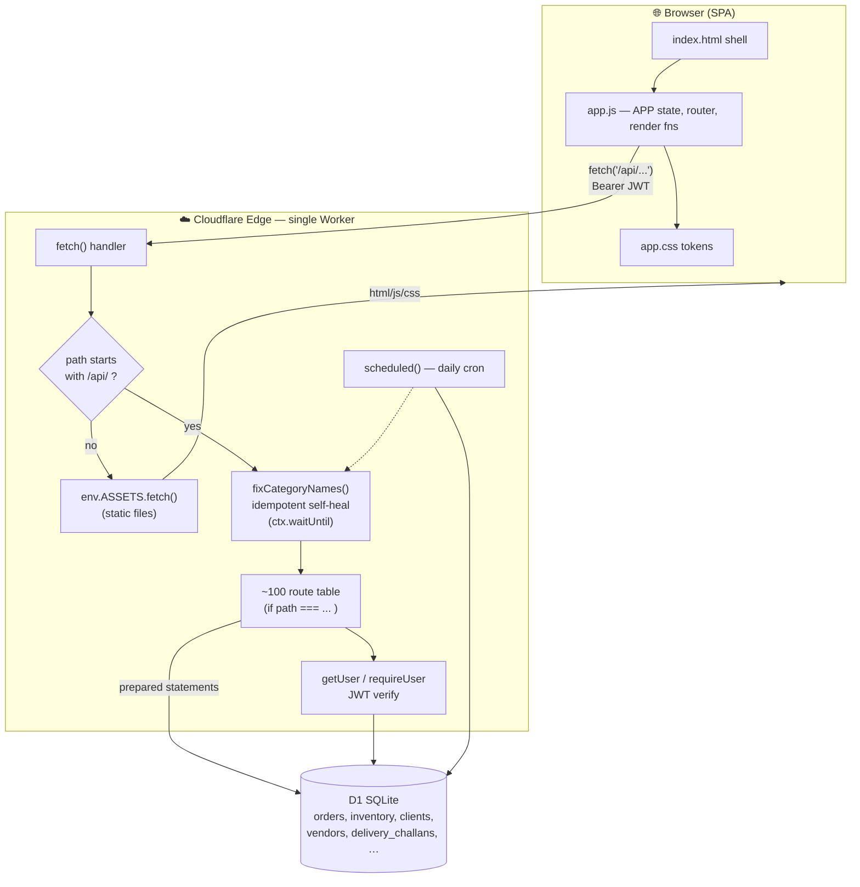

**Key patterns**

- **Unified entry point.** `export default { fetch, scheduled }`. `fetch` first handles
  CORS pre-flight, then splits static vs API by URL prefix.
- **Assets by binding.** Non-`/api/` requests are delegated straight to `env.ASSETS`
  (`public/` directory), so the SPA is served with zero application code.
- **Flat route table.** Routing is a long, ordered sequence of
  `if (path === "..." && method === "...") return handler(...)`. Specific paths are
  listed **before** wildcard regex routes (e.g. `/api/orders/picklist` before
  `/api/orders/:id`) so the first match wins.
- **Runtime self-heal (defensive migrations).** On every API request,
  `ctx.waitUntil(fixCategoryNames(env))` runs an **idempotent** set of
  `ALTER/CREATE … IF NOT EXISTS` and data-normalisation statements, memoized per
  isolate via a module-level flag. This guarantees the live D1 has the columns/tables
  the code expects even if a formal migration was never applied — a belt-and-braces
  companion to `migrations/`.

---

## 4. Request lifecycle (API call)

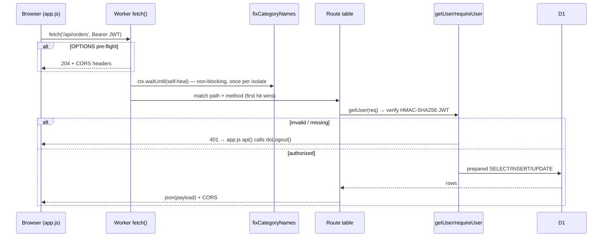

**Frontend side of the contract** (`public/app.js`):

- `const APP = { user, page, cart, charts, token }` is the single in-memory store.
- `api(path, opts)` is the one HTTP chokepoint: attaches `Authorization: Bearer
  <APP.token>`, JSON-encodes, and centralises error handling —
  **`401 → doLogout()`**, other non-2xx → toast + `null` return (callers guard on
  `if (!data) return`).
- Navigation: `NAV[role]` (role → sidebar item list) builds the menu, `PAGE_MAP`
  maps a page id to its render function, and `navigate(page)` swaps
  `#main-content` and calls the matching `renderX(el)`.

---

## 5. Authentication & authorization

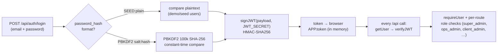

- **Tokens:** compact JWTs signed/verified with Web Crypto `HMAC` + `SHA-256`, secret
  from `env.JWT_SECRET` (set in `wrangler.jsonc` vars for dev; a real secret in prod).
- **Passwords:** PBKDF2 (100k iterations, SHA-256, 256-bit) with a `SEED:` plaintext
  fallback so seeded demo accounts work without a hashing step.
- **Roles** drive both API authorization (per-handler `if (!["super_admin",…]
  .includes(role))`) and the frontend `NAV[role]` menu — the same role string flows
  end-to-end. Optional OTP endpoints (`/api/auth/otp/send|verify`) exist alongside
  password login.

---

## 6. Order lifecycle — the domain FSM

Orders are governed by an explicit finite-state machine (`ORDER_FSM` in
`src/index.ts`). `POST /api/orders/:id/transition` validates that the requested
target is in the current state's allowed set, then writes an `order_history` row —
so every state change is auditable and the pipeline analytics (Control Tower,
bottleneck timings) are derived from real transition timestamps.

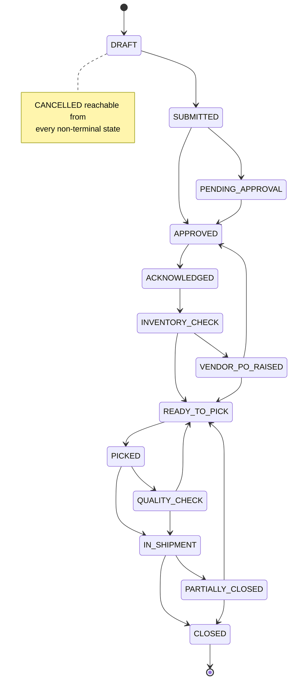

---

## 7. Data layer — migrations + self-heal

Two complementary mechanisms keep the schema correct:

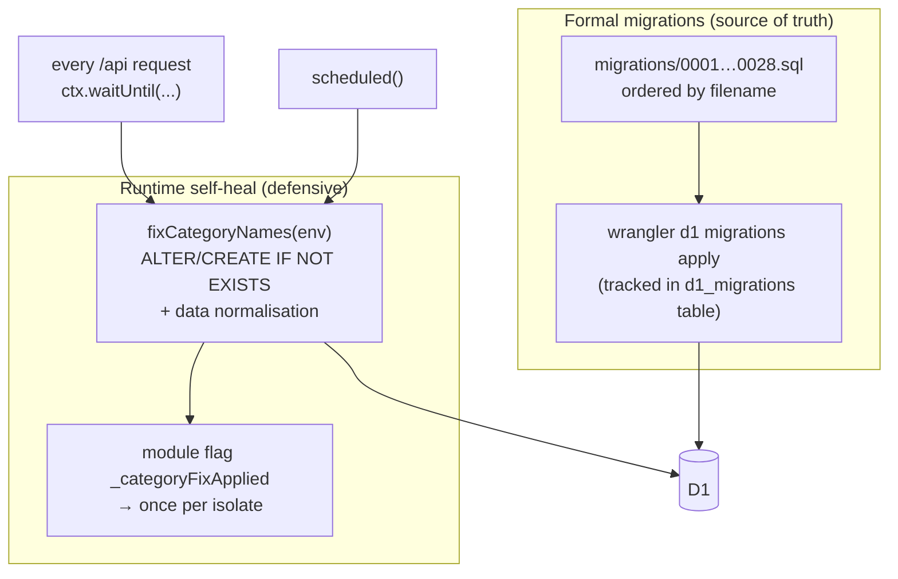

- **Migrations** are the authoritative, versioned schema history. They run via
  `wrangler d1 migrations apply` and are also **replayed in the test harness**
  (`beforeAll`) against a throwaway DB.
- **Self-heal** exists because the live D1 has, historically, drifted from the
  migration set (columns added out-of-band). `fixCategoryNames` re-asserts the
  expected shape idempotently on every request — cheap because it's memoized after
  the first run in each Worker isolate.
- **Lesson encoded in tests:** a fresh DB must be able to replay *all* migrations
  cleanly. When `order_items.category` was referenced by migration 0020 but never
  created, the test suite (which replays on an empty DB) caught it; the fix added the
  column to migration 0006 alongside its siblings.

---

## 8. Build & deployment pipeline

> There is **no hosted CI/CD** in this repo (`.github/workflows` is absent).
> The pipeline is local + Wrangler, driven by `package.json` scripts.

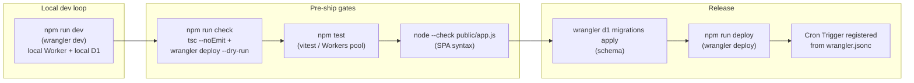

| Script | Command | Purpose |
|---|---|---|
| `npm run dev` / `start` | `wrangler dev` | Local Worker + local D1 + static assets on `:8787` |
| `npm run check` | `tsc --noEmit && wrangler deploy --dry-run` | Type-check + validate the deploy bundle |
| `npm test` | `vitest` | Backend integration tests |
| `npm run deploy` | `wrangler deploy` | Publish the Worker to Cloudflare |
| `npm run cf-typegen` | `wrangler types` | Regenerate `worker-configuration.d.ts` binding types |

**Deploy topology:** `wrangler.jsonc` declares `main: src/index.ts`, the `ASSETS`
binding (`./public`), the `DB` D1 binding, `vars` (JWT secret, env flags, integration
placeholders), and `triggers.crons: ["30 3 * * *"]` (03:30 UTC = **09:00 IST**). A
single `wrangler deploy` ships the API, the static SPA, and registers the cron.

---

## 9. Scheduled work (cron)

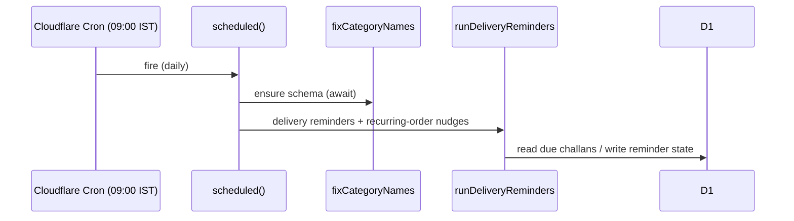

The `scheduled()` export runs the same self-heal first (so the cron never races
ahead of the schema), then `runDeliveryReminders` — daily delivery reminders and
standing/recurring-order nudges.

---

## 10. Testing cycles

Three tiers, fastest → most realistic:

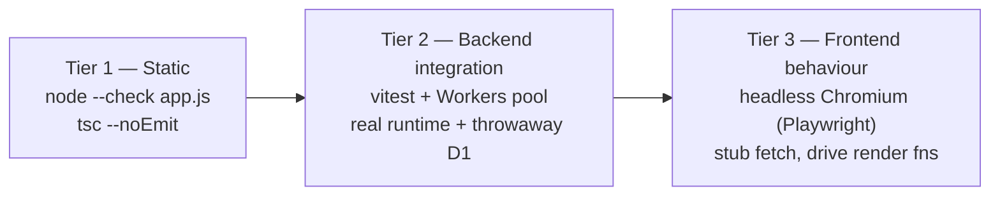

1. **Static checks.** `node --check public/app.js` guards the un-typed SPA;
   `tsc --noEmit` type-checks the Worker.
2. **Backend integration** (`test/index.test.ts`, ~38 tests). Uses
   `@cloudflare/vitest-pool-workers` so tests execute inside a **real workerd
   runtime** with a **fresh D1** per run. `beforeAll` replays every migration
   statement (with retry/`IGNORE` for transient simulator faults and expected
   duplicate-column errors), seeds users/clients/inventory/orders, then exercises
   auth, inventory, vendors, orders, and FSM transitions through `SELF.fetch(...)`.
3. **Frontend behaviour** (headless Chromium via Playwright). Pattern used throughout
   development: `addInitScript` to stub `window.fetch` + `window.Chart`,
   `goto file://…/public/index.html`, set `window.APP.user`, call the target
   `renderX()` function, and assert on the resulting DOM (also used for perf
   benchmarks and screenshots). This is how UI changes are verified without a live
   backend.

---

## 11. Frontend interaction model

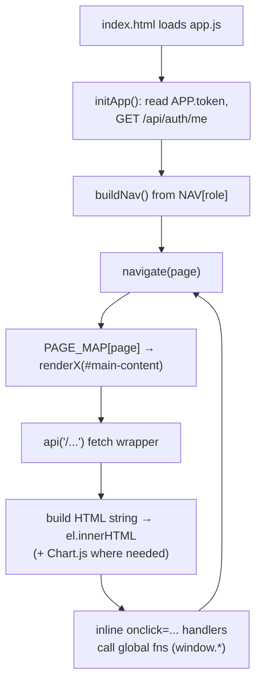

- **Single global state** (`APP`) + **string-templated HTML** injected via
  `innerHTML`; interactivity is wired with inline `onclick` handlers calling
  globally-scoped functions.
- **Design tokens.** `app.css` defines the palette/spacing as CSS custom properties
  (`--primary`, `--navy`, `--danger`, sidebar metrics, …); components read the tokens,
  so re-theming (e.g. the "Fresh Pantry" teal rebrand) is a token edit, not a sweep.
- **Performance patterns baked in:** lazy-rendered detail panels, a render-window cap
  on large tables (with a "Show all" escape hatch), and `Promise.all` batching of
  independent fetches on hot pages (dashboards).

---

## 12. File interaction map

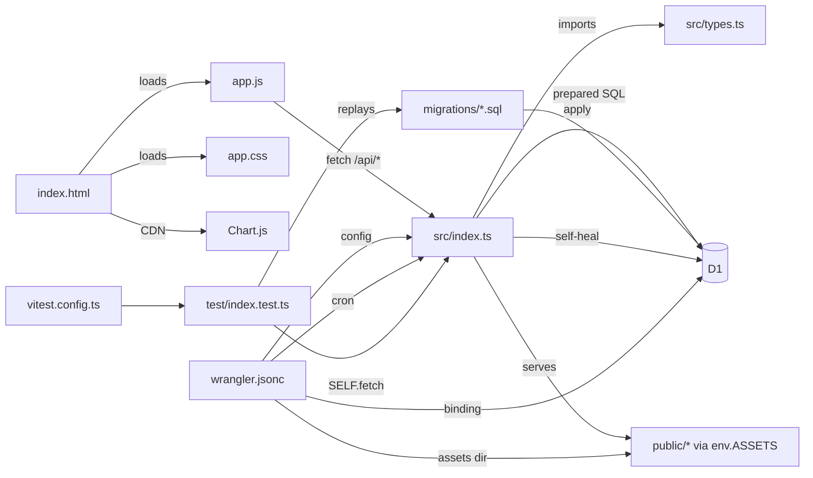

---

## 13. Engineering workflow (how changes are actually made)

The change process observed in this project's history is a tight
**diagnose → edit → verify → commit → push** loop on a dedicated feature branch:

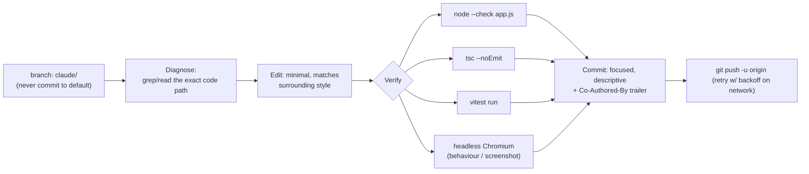

**Conventions**

- **Branch discipline:** develop on the assigned feature branch; never push to the
  default branch without explicit permission.
- **Small, single-purpose commits** with a clear subject and body explaining the
  *why*, plus a `Co-Authored-By` trailer.
- **Verify before commit.** Because there's no CI, verification is local and
  mandatory: the relevant static check(s) always, `vitest` for backend/schema
  changes, and a headless-Chromium drive for UI/behavioural changes. Non-trivial
  changes are exercised end-to-end (real render, real query), not just type-checked.
- **Perf changes are measured**, not assumed — before/after numbers captured with the
  same headless harness (render time, DOM node count).

---

## 14. Cross-cutting conventions & gotchas

- **Route ordering matters** — specific literal paths must precede wildcard regex
  routes in the `fetch` table, or the wildcard swallows them.
- **`api()` returns `null` on failure** (after toasting / logging out); every caller
  guards with `if (!data) return`. Don't assume a resolved value is truthy.
- **Two schema mechanisms** — prefer adding a real `migrations/*.sql` file for new
  columns/tables; use `fixCategoryNames` only for idempotent self-heal that must also
  survive a drifted live DB. Anything referenced by a later migration must be created
  by an earlier one so a fresh DB can replay cleanly (the test harness enforces this).
- **Time scoping** — dashboards/queues can disagree if one counts all-time and another
  defaults to the current month; keep the comparison window explicit and reconcile
  click-throughs (e.g. deep-linking with the month filter cleared).
- **Honest metrics** — trend deltas are computed from real day-over-day snapshots
  (`kpi_daily`), so they render only once history exists rather than showing
  fabricated movement.
- **No frontend build** — `app.js` ships as-authored; keep it valid plain JS
  (`node --check`) and avoid syntax that a browser wouldn't accept directly.

---

*Generated from a full read of the codebase — routes, entry points, migrations,
tests, and configuration. Line counts and route totals are approximate and will
drift as the code evolves.*
