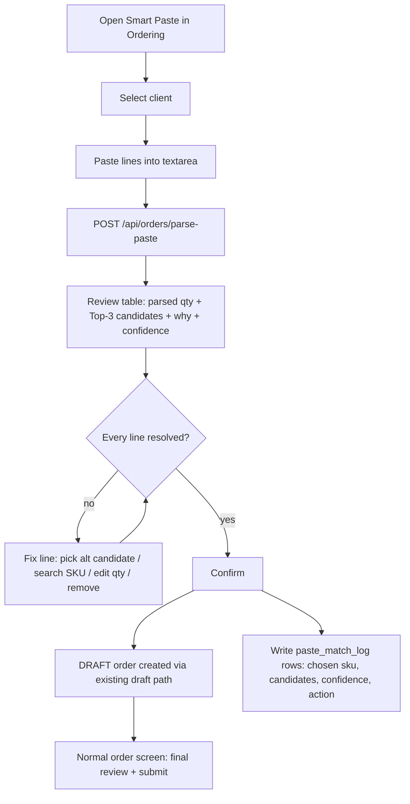

# Product Specification: Smart Paste Order (V1)

> Moniker: `004-smart-paste-order` · Status: DRAFT (awaiting spec-validation) · Owner: Product
> Scope boundary: **V1 is deterministic parse + history-weighted fuzzy match + human review.**
> Knowledge graph, alias auto-learning, AI natural-language parser and semantic/embedding
> matching are **explicitly out of scope for V1** (see §Non-Goals) and sequenced as follow-ons.

## 🎯 Executive Summary
* **Goal:** Let an operator paste a free-text list of items and quantities and turn it into a reviewable **draft order**, where each line is matched to a real SKU from the client's own catalogue/history, with a visible confidence and a plain "why this match".
* **Target User:** `super_admin` / `ops_admin` / `client_admin` entering an order **on behalf of a selected client** (the same role gate as the existing order import).
* **Business Value:** Collapses the slowest step in order entry — typing a known shopping list into the catalogue one search at a time — into paste → review → submit. Reuses the existing `normNameForMatch` matcher and order-draft flow, so cost is low. Every confirmation is logged, creating the labelled data that later unlocks alias learning and smarter ranking (V2+).

## 👥 Decisions locked during grilling (authoritative)
| # | Decision | Choice |
|---|----------|--------|
| D1 | Trust policy | **Always review every line.** No line is ever auto-committed; even a 100% match is pre-selected but requires an explicit Confirm. |
| D2 | Match scope | **Client catalogue + that client's order history only.** Never suggest a SKU the client cannot buy/price. |
| D3 | Unmatched lines | **Keep as an unresolved row** with a manual SKU-search box. Nothing is dropped silently. |
| D4 | Persona | **Ops/admin, for an explicitly selected client.** `client_id` is chosen before/at paste time. |
| D5 | Parse rule | **Unit-aware: quantity = the last bare integer** (a number carrying a unit — g/ml/L/kg/pack/×/case/dozen — stays part of the product text). |
| D6 | Output of Confirm | **A DRAFT order**, created via the existing order-draft path; the user lands on the normal order screen for a final review + submit. Nothing auto-enters the approval workflow. |

## 🛠️ User Stories & Workflows
- **As an** ops operator, **I want to** paste a client's WhatsApp/email order list and have it matched to their catalogue, **so that** I create the order in seconds instead of searching each item.
- **As an** ops operator, **I want to** see why each line matched and how confident the system is, **so that** I can trust or correct it before it becomes an order.
- **As an** ops operator, **I want** lines that don't match to stay visible with a search box, **so that** I never silently drop an item the client asked for.
- **As an** ops operator, **I want** Confirm to produce a normal draft order I still submit myself, **so that** a bad match can never become a live order without my final check.

### Primary workflow


## 📦 Scope
### In scope (V1)
1. A **Smart Paste** entry point in `public/app.03-ordering.js` (tab or modal), CSP-safe (delegated `data-act`/`data-input` handlers, no inline JS).
2. A client selector (pre-selected when the caller already has a client in context).
3. A **deterministic line parser** (§Parsing rules).
4. A **matcher** reusing `normNameForMatch` + token-overlap Jaccard with runner-up margin, scored against the selected client's catalogue ∪ history (§Matching rules).
5. `POST /api/orders/parse-paste` returning, per line: parsed name/qty/unit, ranked Top-3 candidates, confidence, "why" reasons, and a match tier.
6. A **review table** UI: editable qty, candidate chooser, manual SKU search for unresolved lines, remove-line, running item/line count.
7. **Confirm → DRAFT order** via the existing order-draft code path, then redirect to the normal order screen.
8. A **`paste_match_log`** table capturing every line's input text, candidate set, chosen SKU, confidence and the operator's action (accepted / changed / searched / removed / unmatched).

### Non-Goals (explicitly deferred)
- Knowledge-graph / graph DB materialisation.
- Alias table + auto-learning from confirmations (V2 — `paste_match_log` is its seed, but V1 does **not** read aliases).
- AI / natural-language parsing (`env.AI`) — e.g. "5 boxes of the usual Good Day".
- Semantic / embedding matching.
- Substitutions / related-product suggestions.
- Client-user self-service paste (V1 is ops/admin only).
- Auto-submit into the approval workflow.
- CSV/file upload (the existing "Upload Order Sheet" flow is untouched and separate).

## 📐 Parsing rules (D5 — deterministic)
- Input is split on newlines; blank lines and obvious header lines are ignored.
- Each non-blank line is parsed into `{ rawText, productText, quantity, unitHint }`.
- **Quantity = the last standalone integer token on the line that is NOT immediately bound to a unit.** A number is "bound to a unit" if adjacent to any of: `g, kg, mg, ml, l, ltr, litre, pc, pcs, pack, pkt, case, box, dozen, ×, x<digits>`, or a trailing `%`.
- Leading list markers (`-`, `*`, `1.`, `•`) and separators (`,`, `-`, `:`, tab, `|`) between name and quantity are stripped from `productText`.
- `unitHint` captures a trailing order-unit word if present (e.g. "box", "case") for display only; **V1 does not convert units** — quantity is passed through as entered.
- If **no** bare integer is found, `quantity = null` and the line is flagged `needs-qty`.
- Worked examples (these are acceptance fixtures):
  | Raw line | productText | quantity | note |
  |----------|-------------|----------|------|
  | `Goodday 100 - 10` | `Goodday 100` | `10` | `100` bound to nothing but `10` is the last bare int; `100` kept as pack hint only if followed by unit — here ambiguous, see §Edge E1 |
  | `Water 20` | `Water` | `20` | |
  | `Coke 300ml x 24 - 5` | `Coke 300ml x 24` | `5` | `300ml` and `x24` are unit-bound |
  | `Lays Classic 52g` | `Lays Classic 52g` | `null` | needs-qty (only unit-bound number) |
  | `2 x Bisleri 1L` | `Bisleri 1L` | `2` | leading `2 x` quantity form also accepted |

## 🔎 Matching rules (D2)
- Candidate pool for a line = **DISTINCT SKUs in `client_catalog` for the selected client, UNION SKUs that client has in `order_items` history.** No global inventory in V1.
- Scoring tiers (highest wins; ties broken by history frequency then name length):
  1. **Exact** — normalised `productText` equals a candidate's normalised name → confidence 100, reason "exact catalogue match".
  2. **History-weighted fuzzy** — `normNameForMatch` token-overlap score ≥ `MATCH_MIN` (config, default 0.5) **and** beats the runner-up by ≥ `MATCH_MARGIN` (default 0.05). Confidence = round(score×100), boosted (capped 99) by an order-frequency factor. Reasons list the signals: "ordered N times", "same name tokens", "same pack size".
- Each line returns up to **3** candidates sorted by score. The top candidate is pre-selected (D1 still requires Confirm).
- A line with no candidate clearing `MATCH_MIN`+margin is **`unmatched`** (D3).
- Matching is **client-scoped and read-only**; it never mutates catalogue, price or inventory.

## 🔌 API contract — `POST /api/orders/parse-paste`
- **Auth:** same gate as order import — `super_admin` | `ops_admin` | `client_admin`; else `403`.
- **Request:** `{ "client_id": "<id>", "text": "<pasted block>" }`
- **Validation:** `client_id` required and must exist → else `400`; `text` required, non-empty, **≤ 200 lines and ≤ 20,000 chars** → else `400` with a clear message.
- **Response 200:**
```json
{
  "client_id": "C123",
  "lines": [
    {
      "line_no": 1,
      "raw": "Goodday 100 - 10",
      "product_text": "Goodday 100",
      "quantity": 10,
      "unit_hint": null,
      "status": "matched",            // matched | unmatched | needs_qty
      "candidates": [
        { "sku": "BISC-GD-100", "name": "Britannia Good Day 100g", "price": 42,
          "confidence": 96, "tier": "history", "why": ["ordered 8×","same name tokens","same 100g pack"] }
      ],
      "selected_sku": "BISC-GD-100"   // top candidate, or null when unmatched/needs_qty
    }
  ],
  "summary": { "total": 4, "matched": 3, "unmatched": 1, "needs_qty": 0 }
}
```
- This endpoint is **read-only** (no order is created here). Order creation happens on Confirm via the **existing** order-draft endpoint, with a `source: "smart_paste"` tag and the `paste_match_log` write.

## 🗄️ Data model
`CREATE TABLE IF NOT EXISTS paste_match_log` (new, additive migration):
| column | type | note |
|--------|------|------|
| `id` | TEXT PK | |
| `client_id` | TEXT | selected client |
| `order_id` | TEXT NULL | set when the draft is created |
| `line_no` | INTEGER | |
| `raw_text` | TEXT | the pasted line |
| `parsed_qty` | INTEGER NULL | |
| `candidates_json` | TEXT | ranked candidates returned |
| `chosen_sku` | TEXT NULL | what the operator confirmed |
| `top_sku` | TEXT NULL | what the system ranked #1 |
| `confidence` | REAL NULL | chosen candidate's confidence |
| `action` | TEXT | accepted \| changed \| searched \| removed \| unmatched |
| `actor_id` | TEXT | |
| `created_at` | TEXT DEFAULT (datetime('now')) | |

No change to `inventory`, `client_catalog`, `orders`, `order_items`. (Alias table is **not** created in V1.)

## 📋 Acceptance Criteria (Gherkin)

**Scenario: Parse a clean list and match against the client's catalogue**
- **Given** I am an ops operator with a selected client who has "Britannia Good Day 100g" in their catalogue and has ordered it before
- **When** I paste `Goodday 100 - 10` and run Smart Paste
- **Then** line 1 shows quantity `10`, top candidate "Britannia Good Day 100g" with confidence ≥ 90 and a reason that includes an "ordered N×" signal.

**Scenario: Quantity extraction is unit-aware (D5)**
- **Given** the paste contains `Coke 300ml x 24 - 5`
- **When** it is parsed
- **Then** the quantity is `5` and the product text is `Coke 300ml x 24` (neither `300` nor `24` is taken as the quantity).

**Scenario: A line with only a unit-bound number is flagged needs-qty**
- **Given** the paste contains `Lays Classic 52g`
- **When** it is parsed
- **Then** the line status is `needs_qty`, no quantity is assumed, and the review row shows an editable quantity field the operator must fill before Confirm is enabled for that line.

**Scenario: Matching is scoped to the client (D2)**
- **Given** SKU "Kinley Water 1L" exists in global inventory but is NOT in the selected client's catalogue or history
- **When** I paste `Water 20`
- **Then** "Kinley Water 1L" is NOT offered as a candidate; only the client's own water SKUs appear, and if none clear the threshold the line is `unmatched`.

**Scenario: No line is auto-committed (D1)**
- **Given** every line matched at 100% confidence
- **When** the review table renders
- **Then** each line is pre-selected but the draft order is NOT created until I click Confirm.

**Scenario: Unmatched line is preserved, not dropped (D3)**
- **Given** a pasted line matches nothing above threshold
- **When** the review table renders
- **Then** the line appears with status "no match" and a SKU search box, and **Confirm is blocked** until every line is either resolved to a SKU or explicitly removed.

**Scenario: Confirm produces a draft, not a submitted order (D6)**
- **Given** all lines are resolved
- **When** I click Confirm
- **Then** a DRAFT order is created for the selected client with the chosen SKUs and quantities, I am taken to the normal order screen, and the order has NOT entered the approval workflow.

**Scenario: Every decision is logged (learning seed)**
- **Given** I confirm a draft where I accepted 2 top matches, changed 1 to a different candidate, and removed 1 unmatched line
- **When** the draft is created
- **Then** `paste_match_log` has one row per original line recording raw text, candidates, top_sku, chosen_sku and action (`accepted`/`changed`/`removed`) linked to the created `order_id`.

**Scenario: Authorisation**
- **Given** I am a `client_user` (not admin)
- **When** I call `POST /api/orders/parse-paste`
- **Then** I receive `403` and the Smart Paste entry point is not shown to me.

**Scenario: Oversized paste is rejected safely**
- **Given** I paste more than 200 lines or more than 20,000 characters
- **When** I run Smart Paste
- **Then** I get a clear error telling me the limit, and no partial parse is created.

**Scenario: Duplicate product lines are merged on review**
- **Given** the paste contains `Water 20` and later `water 10` resolving to the same SKU
- **When** the review table renders
- **Then** the operator is shown both lines mapping to the same SKU and can merge to quantity 30 (merge is offered; not silent).

## 🚨 Constraints & Edge Cases
- **E1 — pack-grams vs quantity ambiguity** (`Goodday 100 - 10`): the parser keeps `100` in product text (used to match the 100g pack) and takes `10` as quantity. Because D1 forces review, the operator can correct a wrong split; the review row shows the parsed split explicitly (name vs qty in separate editable fields).
- **E2 — line with two bare integers and no units** (`Pens 12 5`): take the **last** as quantity, flag the line `low-confidence-parse` so it visually stands out in review.
- **E3 — zero / negative / non-numeric quantity**: treated as `needs_qty`; Confirm blocked for that line.
- **E4 — client has empty catalogue & no history**: endpoint returns all lines `unmatched` with a banner "this client has no catalogue/history yet — resolve each line manually".
- **E5 — candidate SKU inactive or out of stock**: still matchable (ordering allows backorder elsewhere); show a muted "out of stock" chip, do not exclude. No availability gating in V1.
- **E6 — price missing for a client SKU**: candidate still shown; price displays "—"; draft creation follows whatever the existing order-draft path already does for a priceless line (no new behaviour invented here).
- **E7 — idempotency**: re-running parse on the same text is pure/read-only and creates no rows; only Confirm writes. Double-click Confirm is guarded by the app's existing in-flight action lock.
- **E8 — matcher performance**: candidate pool is per-client (bounded); token index built per request over that pool only. Target: parse+match of a 100-line paste completes within the Worker's normal request budget; if the pool query is heavy, cap candidate pool and document it.
- **E9 — CSP**: all interactivity via delegated `data-*` handlers resolving to top-level globals; smoke test "all delegated targets resolve" must stay green.

## 🎨 UI/UX (textual)
- Entry: a **"📋 Smart Paste"** action in the Ordering page header / FAB, alongside the existing "Upload Order Sheet".
- Step 1 — **client + paste**: client picker (locked if already in context) + a large textarea with placeholder showing the accepted format and 2–3 examples.
- Step 2 — **review table** (reuses existing table/tile styling): columns = `#` · parsed *Item* (editable product text) · *Qty* (editable) · *Match* (candidate dropdown showing name · pack · price) · *Confidence* (a small meter/%) · *Why* (reason chips) · *Status* · row actions (search, remove). Unmatched rows are tinted and carry the SKU search box inline.
- A sticky footer: "N of M lines resolved · ₹subtotal" and a **Confirm** button **disabled until every line is resolved or removed**.
- "Why this match" is always visible as chips (e.g. `ordered 8×` · `same pack 100g`) — the trust feature, not hidden behind a tooltip.

## 📊 Success Metrics (measured from `paste_match_log`)
- **Match acceptance rate** = accepted / (accepted+changed+searched) — target ≥ 70% of matched lines accepted unchanged in first month.
- **Unmatched rate** = unmatched / total lines — watch; high values flag catalogue/history gaps.
- **Time-to-draft** vs manual entry (qualitative in V1).
These metrics are also the readiness signal for V2 (alias learning): once we have N confirmed `changed`/`searched` corrections, they seed the alias table.

## 🔗 Follow-on milestones (post-V1, not in this spec)
- V2 — **Alias learning**: materialise a client-scoped alias table from `paste_match_log` corrections; matcher consults it as tier-0.
- V3 — **History-weighted ranking upgrades** (recency, brand/pack preference).
- V4 — **AI natural-language parser** (`env.AI`) for lines the deterministic parser flags, gated behind it.
- V5 — **"Same as last week"** reconstruction from history/standing orders.
- V6 — semantic/embedding fallback for the long tail; graph only if real multi-hop needs appear.
